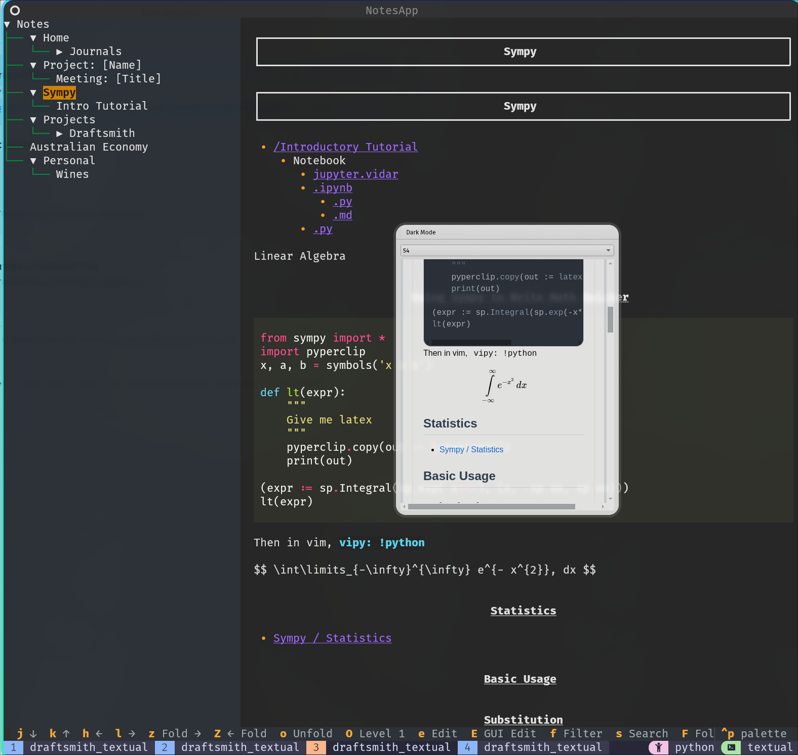

# Draftsmith TUI

A terminal user interface for Draftsmith PyQt markdown preview support.

## Installation

Install using pipx:

```bash
pipx install git+https://github.com/RyanGreenup/draftsmith_textual
```

## Screenshot



## Usage

Start the markdown preview window:

```bash
ds-preview --socket-path /tmp/markdown_preview.sock
```

In another terminal, start the TUI:

```bash
ds-tui
```

### Key Bindings

- Press `g` on a note to update it in the preview window
- Use arrow keys to navigate
- Type to filter notes

### Options

Both commands support various options:

```bash
EDITOR=nvim GUI_EDITOR=neovide ds-tui --help
ds-preview --help
```

Common options include:
- `--api-scheme`: HTTP scheme (default: http)
- `--api-host`: API host (default: localhost)
- `--api-port`: API port (default: 37240)
- `--socket-path`: Socket path for preview communication


The `GUI_EDITOR` environment variable can be used to specify the GUI editor to use when opening a note with <kbd>E</kbd>.

## Development

```bash
git clone https://github.com/RyanGreenup/
cd draftsmith_css
poetry run python markdown_preview.py --socket-path /tmp/md.sock 2>/dev/null & disown
poetry run python main.py --socket-path /tmp/md.sock
```

